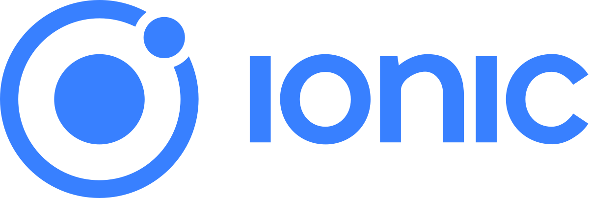

<!-- PROJECT LOGO -->
 

  

  <h3 align="center">ChatPools</h3>
  
Dive into your community

   
   

  

    <a href="empty">View Video</a>
    ·
    <a href="https://github.com/miguelcanosantana/ChatPools/issues">Report Bug</a>
  

 

## About The Project
ChatPools is an Open Source chat client focused on it's community.
The main goal of ChatPools is to allow to it's users to make "Pools" (Chat rooms) based on their interest for communicating with people with the same interests.

## Project Structure
<ol>
  <li>ChatPools App: This repo and the main app for mobile users</li>
  <li>PoolTabs App and Website: The dashboard for administrators of the main app</li>
</ol>

 

Click the name for a link to the repository of Pool Tabs App.

## Technologies Used

## Mockup of the main App

