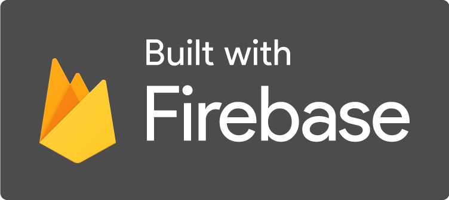

<!-- PROJECT LOGO -->
 

  

  <h3 align="center">ChatPools</h3>
  
Dive into your community

   
   

  

    <a href="https://youtu.be/f56JraMWI8Y">View Video</a>
    ·
    <a href="https://github.com/miguelcanosantana/ChatPools/issues">Report Bug</a>
  

 

## About The Project
(New) Release: https://github.com/miguelcanosantana/ChatPools/releases/tag/release
ChatPools is an Open Source chat client focused on it's community.
The main goal of ChatPools is to allow to it's users to make "Pools" (Chat rooms) based on their interest for communicating with people with the same interests.

## Project Structure
<ol>
  <li>ChatPools App: This repo and the main app for mobile users</li>
  <li>PoolTabs App and Website: The dashboard for administrators of the main app</li>
</ol>

 

Click the name for a link to the repository of Pool Tabs App.

## Technologies Used

 
 

 

## Mockup of the main App

## Progress Diary
### 1st Week (Starting at 12/04/2021)
<ol>
  <li>ChatPools App: App is created</li>
  <li>
    As https://www.mongodb.com/nosql-explained/data-modeling says, visual schemas of NoSQL DBs should have a JSON format as they can change easily over the time, so in my marker board I tried to draw how data will be organized inside Firebase:
    
  </li>
</ol>

### 2nd Week (Starting at 19/04/2021)
<ol>
  <li>All References I look are now located in the References file at the root of the project</li>
  <li>Added the Ubuntu font family</li>
  <li>Added some services and pages</li>
  <li>Added a loading screen page that will read the url parameters and redirect to different pages depending on them</li>
</ol>

### 3rd Week (Starting at 26/04/2021)
<ol>
  <li>Created the colors for the app</li>
  <li>Added a login checker to see if previous users were connected</li>
  <li>Made Login page</li>
  
</ol>

### 4th Week (Starting at 03/05/2021)
<ol>
  <li>Designed register page with animated svg</li>
  <li>When creating an user it's username it's added to the db</li>
  <li>Completelly Redesigned chats ui</li>
</ol>

### 5th Week (Starting at 10/05/2021)
<ol>
  <li>Designed the pools page</li>
  <li>Completely revamped the chat</li>
  <li>Created all the methods for talking in the chat as an user</li>
  <li>Created PoolTabs control panel app</li>
  <li>First version released as apks https://github.com/miguelcanosantana/ChatPools/releases/tag/test</li>
</ol>

### 6th / 7th Week (Starting at 17/05/2021)
<ol>
  <li>Redesigned some aspects of the chat</li>
  <li>Rebuilt the project and changed all the structure of the pages and services</li>
  <li>Added 3 tabs for the main interface</li>
  <li>Added Chat Bubbles Animation</li>
  
</ol>

### Last Weeks
<ol>
  
 Last weeks have been the most intense...

  <li>Rebuilt some aspects of the project</li>
  <li>Implemented ban logic</li>
  <li>Implemented search filter</li>
  <li>Stable Android Builds</li>
  <li>Users can take or select pictures</li>
  <li>Configured FireStore storage</li>
  <li>Completely redone PoolTabs App</li>
  <li>Admins can now ban/unban manage roles of users, create, delete or update pools</li>
  <li>PoolTabs now hosted at https://chatpools-pooltabs-test.web.app</li>
</ol>
